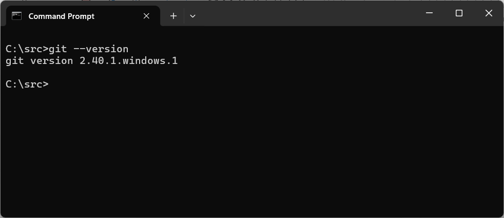
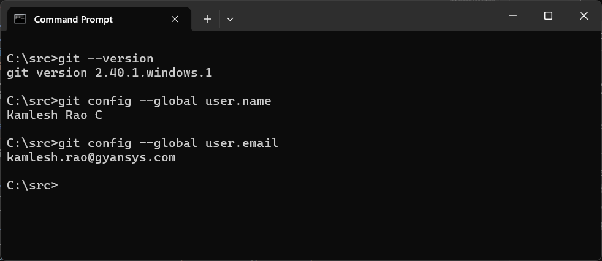
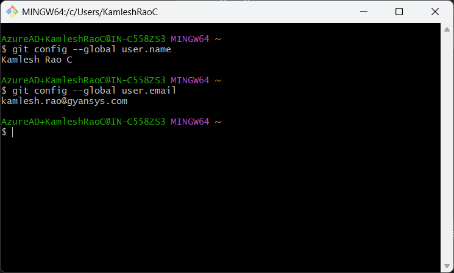

# Git (Windows)

## Assumptions
1. You have created a GitHub account for yourself using your Office Email ID.  
1. If you don't have GitHub account, then Sign Up for an account [here](https://github.com/).

## Is Git already installed?
Check if already have Git installed on your Windows Laptop
1. Open Command Prompt
1. Type `git --version` command. 

1. If the above command gives you error, then you don't have **Git for Windows** installed on your laptop.

## Install Git for Windows
The below steps will guide you to install Git for Windows for the first time on your laptop.   

1. Download the latest version of Git for Windows (64-bit) from this [link](https://git-scm.com/downloads/win).  At the time of writing this article, the current version is 2.49.0.
1. Send email to IT Support Team to get this installed on your laptop.  During the installation process, the setup wizard will ask you few questions.  Choose the default options during the setup.
1. Post installation, try the `git --version` command as shown in the earlier section.

## Configure Git
The below steps will help you to configure your Git for the first time. _This is a one time activity._

1. Open Windows Command Prompt or Git Bash.
1. Setup your **User Name** by using the below command
    ```
    git config --global user.name "Your Name"
    ```
    Example:
    ```
    git config --global user.name "Kamlesh Rao C"
    ```
1. Setup your **Email** by using the below command
    ```
    git config --global user.email "work.email@example.com"
    ```
    Example:
    ```
    git config --global user.email "kamlesh.rao@gyansys.com"
    ```

## Verify Git Configuration
At any time you can use the below commands to check your current Git User Name and Email:

1. Open Windows Command Prompt or Git Bash.
1. Check your **User Name** and **Email** by using the below command
    ```
    git config --global user.name
    git config --global user.email
    ```
    

    The same can be done from Git Bash, you will see the below screen if you are using Git Bash.

    
